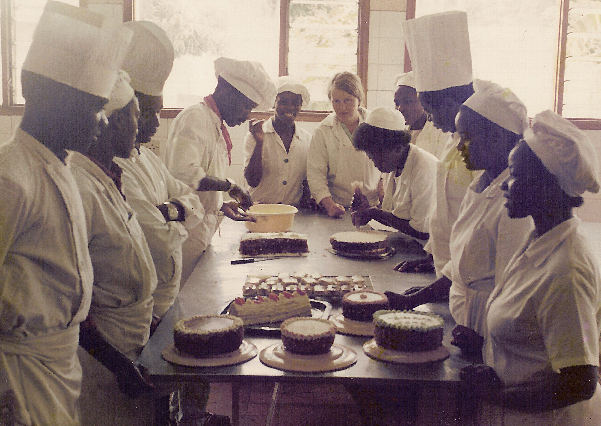
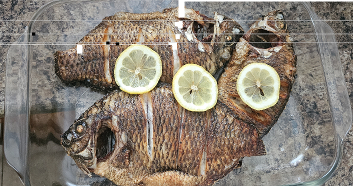
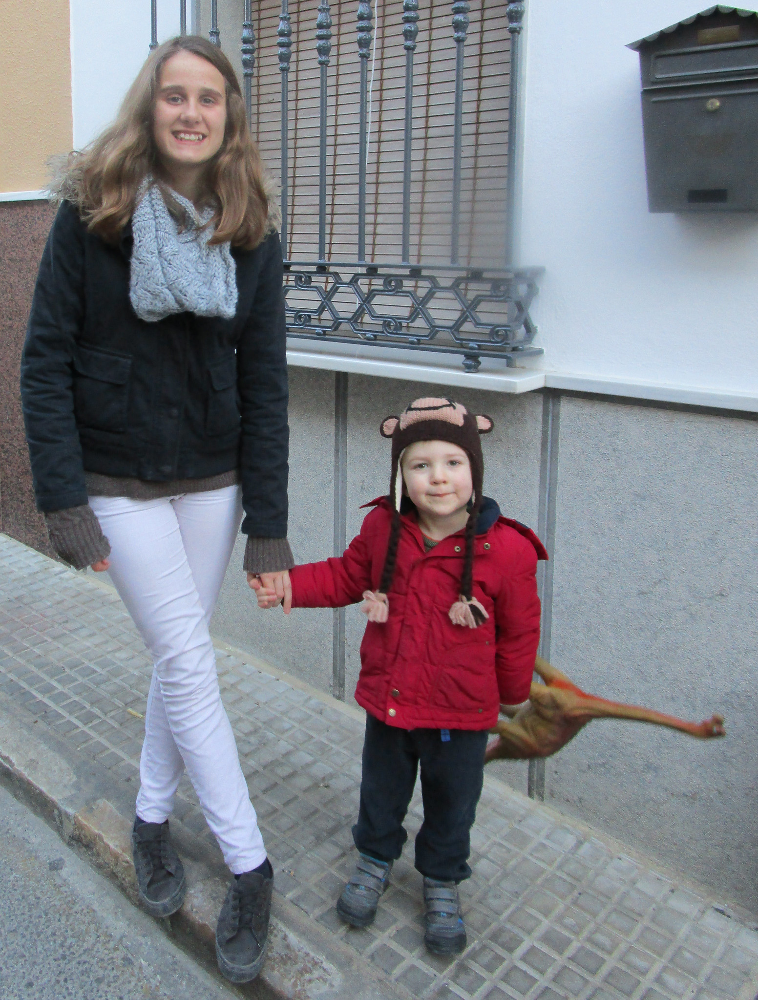
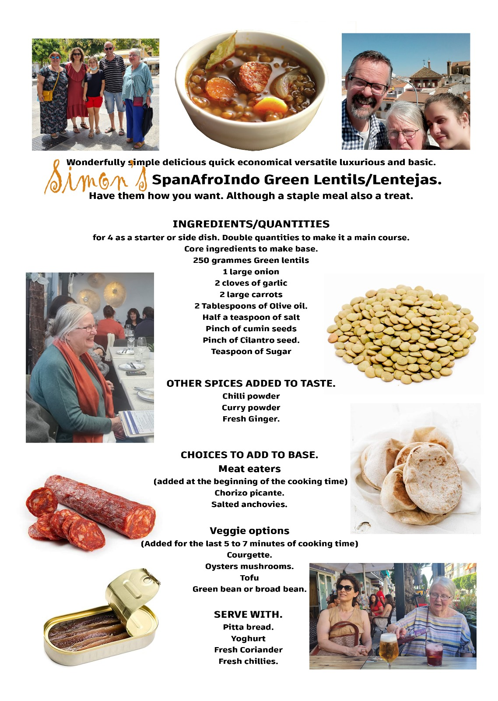
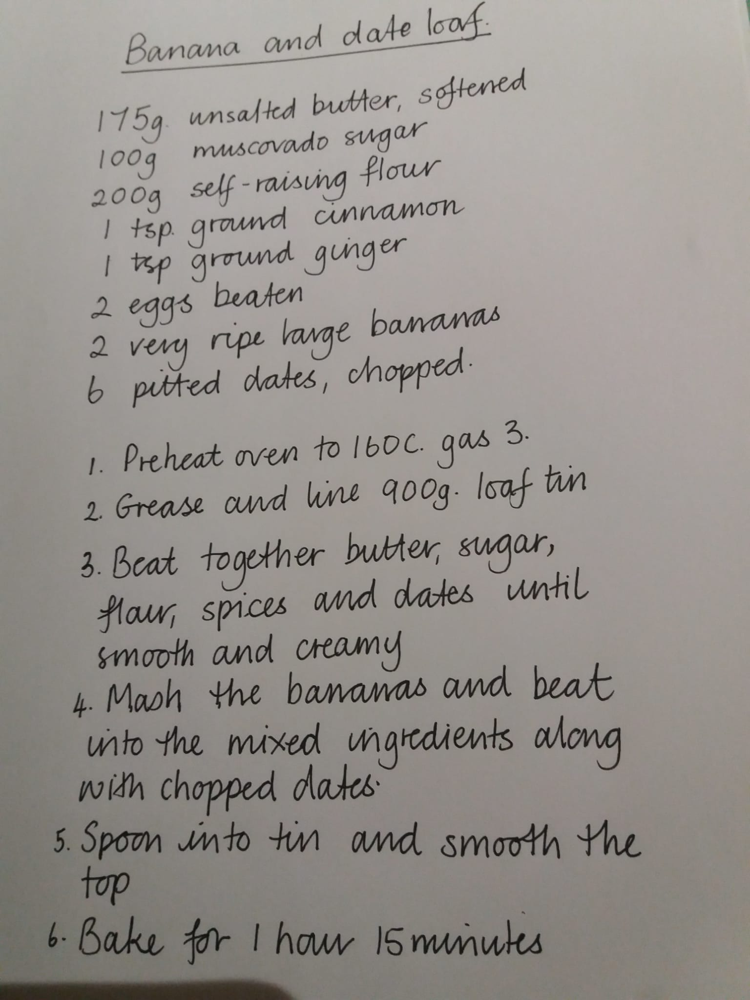

---
output:
  pdf_document:
    latex_engine: xelatex
---

```{r setup, include=FALSE, fig.align='center'}
knitr::opts_chunk$set(echo = FALSE)
library(bookdown)
```


# JJ's Food Stories.
    
\vspace{1cm}

Judy you have always been keen on the art and craft of cookery and the enjoyment of meals together. Thanks to you, many of us are confident in the kitchen, whether it is taking on an ambitious creation or knocking something together from whatever is in the back of the cupboards.

\vspace{1cm}

```{r, evelyn, fig.align='center'}

```


\newpage

## Some recipes from Maria and Gertrude:

```{r maria, out.width="48%",fig.align=c("centre")}
knitr::include_graphics(c("./images/joseph_maria.jpg","./images/gertrude.jpg"))
```


\newpage
### Fried Fresh Fish (Tilapia) (Nsomba yo kazinga)
\vspace{1cm}
```{r, nsomba, fig.align='center'}

```

\vspace{1cm}

#### Ingredients:
\
Tilapia

Salt

Lemon slices for decorating (absolutely optional)

¼ cup of Cooking oil

#### Preparation:

Clean the fish by removing scales and innards. You can cut the heads off if so desired. Personally, the heads are the best part of the fish. If you decide to keep the heads, make sure to clean the inside and remove the gills.

Wash the fish and pat dry.

Make slits about the body and rub salt into it. 

Cooking Instructions:

Heat a pan with oil on the stove top

Put the fish in once the oil is hot. Reduce the heat to medium.

Depending on the size of the fish, cook it for 5/6 minutes on each side.

You'll know it's ready when it's golden brown.

You can serve this with some vegetables and nshima. Or, you can eat it as is with a beer for a snack. This is our favorite Lazy Friday dinner! (No beer for the kids though….)

\newpage

### Fresh Turnip Greens
\vspace{1cm}

```{r greens, fig.align='center'}
knitr::include_graphics('./images/greens.jpg')
```


Most meals are not complete with a vegetable accompaniment. So here goes:

#### Ingredients:
\
2 bunches of turnip greens (You can use any leafy greens such as collard greens, mustard greens, Swiss chard or spinach).

Half an onion

1 tomato

Salt to season

2 - 3 Tablespoons of Cooking oil

Preparation:

Wash each vegetable leaves thoroughly.

Make a bundle and cut the vegetable finely.

Wash the onion and tomato and chop them into cubes.

#### Cooking Instructions:
\
Put a pan on the stove top on medium heat. Put some oil (3 table spoons) in it to heat.

Once the oil is hot, lightly fry the onions. Then add the greens and tomatoes. Turn them and add about 2 pinches of salt. (Add one first and taste to see if you need a second pinch)

Add a little water (1/4 cup) and simmer. When the water finishes, slightly fry it and it should be ready. Cooking time varies according to the vegetable choice. This works best for turnip greens.

\newpage

### Bean Stew (Nyemba)
\vspace{1cm}
```{r beans, fig.align='center'}

```

 
#### Ingredients:
\
2 medium cans of pinto beans (This is the cheat version. Normally, it’s cooked from scratch: using dried beans)

1 Tomato

½ Onion

1 pepper 

Paprika

2 or 3 Tablespoons of oil

Salt

#### Preparation:
\
Wash the onion, pepper and tomato. 

Dice them.

Cooking Instructions:

Heat the pot or pan on medium heat and add the oil till it’s heated. 

Lightly fry the tomatoes, onion and pepper.

Add a few shakes of paprika and salt.

Add the beans. 

Simmer for about 10 minutes or when the liquid has reduced.

Add a pinch of salt and taste for your liking. Ready for serving. It tastes even better on the second day.

\newpage

### Braai Chicken (Nkuku yo ocha)

\vspace{1cm}

```{r nkuku, fig.align='center'}

```


#### Ingredients:
\
Chicken pieces (boned/deboned, skin/skinless is really as you prefer)

Garlic

Lemon Pepper

Chicken spice

Salt for seasoning

#### Preparation:
\
Clean the chicken pieces. Skinless is optional.

Pat the pieces dry with paper towel.

Season with salt, lemon pepper and chicken spice.

Add ¼ cup of oil and leave to marinate for an hour or more.


#### Cooking Instructions:
\
Prepare a mbaula if you have one OR a BBQ stand will do OR grill.

Put it on a rack on the hot mbaula and cook each side until it’s a nice brownish color. Keep turning it and please don’t burn it. Serve as an accompaniment with your meal. Enjoy!

\newpage

###  Kapenta

 
#### Ingredients:
\
2 Handfuls of kapenta OR sardines

Green pepper (optional)

1 medium size onion

1 large tomato

4 Tablespoons Oil

Salt

¼ cup of water

#### Preparation:
\
Sort the kapenta carefully and remove any debris 

Wash the kapenta several times with warm water until it’s clean.

Dice the onion, tomato and green pepper

#### Cooking Instructions:
\
Heat the pan on medium heat and add cooking oil to it. Lightly fry the Kapenta until golden brown.

Add a pinch or two of salt (to your taste), tomatoes, onion and pepper. Lightly fry the ingredients. Then add ¼ cup of water.

Simmer for about 10 – 15 minutes or when the liquid has reduced. Taste for tenderness. Serve.

\newpage

### Vitumbuwa (Fritters)

\vspace{1cm}

```{r tumbuwa, fig.align='center'}
knitr::include_graphics('./images/tumbua.jpg')
```

#### Ingredients:
\
2 cups:  All Purpose flour

2 Teaspoons of baking soda

¼ Cup sugar

4 Eggs

1 cup milk

Pinch of salt

1 cup of oil

##### Preparation:
\
Sift the flour into a mixing bowl.

Add sugar and pinch of salt.

Whisk the milk and eggs and pour into the bowl with dry ingredients. Mix together into a thick batter.

Taste to see if there is enough sugar and salt to your liking. They’re usually not too sweet.

#### Cooking Instructions:
\
Heat the oil in a pan on medium heat.

Scoop tablespoon fills of batter. Place them separately into the pan and let it fry for 3 minutes and turn over and let it fry again for 3 minutes till a golden-brown color. If it’s cooking too quickly, reduce the heat and maybe the size of the spoon full that you put in the pan.  Remove one to check if it’s cooked in the center. Remove the fritters from the pan and put them on a plate with paper towel for the excess fat to drain. Add more spoon fills to the pan. Repeat till the batter is finished. Serve as a snack or have them with a cup of tea.

\newpage

### Nsima (Nshima)


#### Ingredients:
\
3 cups of maize meal flour or (mealie meal) 

3 cups of water

#### Preparation:
\
Put the water in a pot and bring to boil on the stove top.

Take 1 cup of mealie meal and make a runny paste with 1 ½ cups of water. Pour this mixture into the pot and stir quickly (to avoid forming lumps) with a cooking stick.

Cover the pot and leave to boil for about 8 - 10 minutes.

Slowly add in the remaining mealie meal while stirring all the while till it becomes a thick dough. Leave on the stove to cook for an extra 5 minutes, stir and leave for another 5 - 8 minutes. Remove from the stove and serve in a thermos plate to keep warm or flat plate if it's eaten immediately.

\newpage

### Goat Stew:

#### Ingredients:
\
Goat (or you can use Lamb) meat

1 large Onion

2 tomatoes

1 pepper 

Paprika

Salt 

1 Teaspoon Cumin or coriander

2 or 3 Tablespoons of oil


#### Preparation:
\
Wash the onion, pepper and tomato. 

Dice them.

Grind or crush the cumin

Wash the goat pieces and remove excess fat. Pat dry with a paper towel.

Cooking Instructions:

Heat the pot or pan on medium heat and add the oil till it's heated. 

Lightly fry the tomatoes, onion and pepper.

Add a few shakes of paprika, 2 pinches of salt and cumin.

Add the goat meat and stir.

Simmer for about 10 minutes or when the liquid has reduced then turn the goat meat over. Let it simmer and repeat.

Add 3 cups of water and cook on low heat or you can use a slow cooker. Let it simmer for 1 ½  - 2 hours till the gravy has reduced and is not too runny. Also, check to make sure that the goat is tender.

Ready for serving. 

\newpage

# A recipe from Candida!

```{r candida, out.width="50%",fig.align=c("centre")}
knitr::include_graphics(c("images/candida.jpg",
                          "images/rob.jpg"))
```

```{r candida2, out.width="50%",fig.align=c("centre")}

```

## PASTA E CECI

\vspace{1cm}
```{r ceci, out.width="30%", fig.align='center'}

```
\vspace{1cm}

#### Ingredients:
\
serves 6
4 cloves garlic
1  small onion
2 small carrots
2 sticks celery
tomato puree or 6 plum tomatoes
use  300gr dry chickpeas soaked overnight and then boiled  OR
two tins of chickpeas drained and washed. 
small pasta or broken up spaghetti
2 tins chickpeas drained and washed
2 sprigs rosemary stock or stockcube of your choice
1/2 chilli optional
pepper/ salt( not a lot if using cubes)
olive oil
\


1) Make a soffritto with olive oil, the onion/carrots/celery chopped veryvery small add garlic, sautee, do not burn.....

2) add Tomatoes ( chopped) or puree, little water, rosemary sprigs, stock or cube and water add drained  chick peas from tin OR  if using  the dry ones add the soffritto etc to the pan with the cooked chickpeas, boil together for a while.

3) add the pasta , boil until cooked

A lovely thick soup for any season......
I have been cooking it for years.....

Hope it's all clear.....

Hope to see you soon in Italy Judy.....or che toi in Antequera!
Cannot believe we met over 40 years ago! 
Buon appetito
Candida

\newpage

# From Chela, Claire and Stanley

```{r chela1, out.width="50%", fig.align='center'}
knitr::include_graphics(c('./images/stanley_cake.jpg','./images/judy_claiire.jpg','images/judy_chela.jpg'))
```

```{r journey_bread, fig.align='center'}
knitr::include_graphics('./images/journey_bread.pdf')

knitr::include_graphics('./images/farfalle.pdf')

knitr::include_graphics('./images/puttanesca.pdf')
```
# From Nick and Family:
```{r nick_fam, fig.align='center', out.height="70%"}
knitr::include_graphics('./images/nick_fam.jpg')
```
```{r emere_yona, fig.align='center'}
knitr::include_graphics('./images/emere_yona.jpg')
```
"Emere Yona" is an expression in Uganda to suggest 'a bit of everything'.
It's not very common in tourist areas and only a few restaurants will offer this. However, it's very common in local or traditional restaurants.

The variety of staple foods include a mix of all or many of the following: Posho (nshima), rice, sweet potato, pumpkin, yam, chapati, cassava, matooke and so on.

These are eaten with sauces (relishes) including binyebwa, beans, greens, nyamas (meats) and fish.

The food (carbohydrates) would go with a sauce, beans, some pasted fish, Luwombo, chicken or meats of some sort.
2 mins ago
Peanut sauce is called binyebwa, which is raw groundnuts ground into a paste and cooked as a sauce to add to fish, chicken or meat. This makes the pink colouring to the meal. This is a very special quality to Ugandan foods. 

The greens include nakati, sukuma wiki, cabbage, entula, katunkuma (small), eggplant, green pepper and so on.

Matooke (Musa acuminata) is a green banana used as a staple in cooking.

Luwombo is a stew steamed in banana leaves; it has been considered to be a very special dish that was/is served only to very important guests in Ugandan culture.

Nakati - Ethiopian Eggplant (Solanum aethiopicum). The leaves are a very popular green and delicious. 
Sukuma wiki (collard greens) is an East African dish cooked with onions and spices.
Entula (Solanum macrocarpon) is an African baby egg plant
Bitter Berries (Katunkuma) are also used as a green

\newpage
# From Pilar
```{r pilar, fig.align='centre'}

```

```{r avocado, fig.align='centre'}
knitr::include_graphics('./images/avocado.pdf')
```

# From Isabel

```{r isabel, fig.align='centre'}

```

```{r salmon, fig.align='centre'}
knitr::include_graphics('./images/salmon_wellington.pdf')
```
# From Simon
```{r lentejas1, fig.align='centre'}

knitr::include_graphics('./images/lentejas_method.jpg')
```

# From Clare

```{r hoptons, out.width="48%", fig.align='centre'}
knitr::include_graphics(c('./images/claire_fam.jpeg','./images/martha_simming_goggles.jpeg','images/isa_alice.jpeg','images/clare_n_julia.jpeg'))

```

```{r sauce,out.width="60%", fig.align='centre'}
knitr::include_graphics(c('./images/brown_rice.jpeg','./images/soy_sauce.jpeg'))
```

\newpage

# From Alice

```{r alice, fig.align='centre'}

```
## Fond memories: 

### Mac and cheese

Pilar, Robert, Isabel, Martha and I used to love mac and cheese day in Bedlinog during our Summer holiday visits. Judy would always use shell pasta as we would call it, or conchiglie as they call it in Italy. It was the simplest, most delicious pasta that I had ever tasted and not once have I or my family successfully replicated it. I have a distinct memory of picking up a recipe from grandma Judy, reading it out to mum and her saying "there's no way we are using a whole block of cheese" and realising, that's why it would never taste as good. The delicious, peppery, creamy and cheesy meal would fill you up for what you felt like might be an entire week. 

### Fruit salad afternoons

Every afternoon on our Summer visits to Bedlinog the cousins would sit and watch cbeebies, CBBC, nickolodeon or whatever we could find on the Children's section of sky tv, and eat grabdma Judy's great big shared plates of lovingly chopped up fruits: peach, nectarine, oranges, apples, bananas, pears or whatever was available from the local stores in Bedlinog at the time, which was amazing because each great big pile of fruit always looked so tropical and inviting. 

There's something so delicious about a shared plate, that increases the taste levels of your favourite when you're anxious someone else is going to grab the last piece!!

### 7 course meal

I distinctly remember the fanciest meal I have ever eaten - at the culinary school in Antequera with Judy. Now, I don't remember all the courses but I do remember the intensity of the rich flavours and how full and ready for a siesta I felt afterwards, after the endless courses kept coming and coming. There was an amazing seabass course with 2 different sauces: a white and a red wine sauce that was like nothing I've tasted before. 

### Fartons in Ronda and Churros in Antequera

We all know Abuela Judy for her delicious savoury meals, but we also sometimes enjoyed a sugary sweet treat together the tasty fartón for example - sugary sweet pastries in the beautiful town of Ronda, that I'd stared at on a painting of the famous Puente Nuevo bridge in the Bedlinog house. One visit to Antequera when I was around 9 or 10 I distinctly remember wanting to have churros con chocolate EVERY time I visited a cafe with Judy or my parents. I presumed it was a daily activity, a standard breakfast for the Spanish, and I relished the opportunity to compare the different textures, lengths and sizes of churros. I was fascinated by the new food and blissfully unaware of the concept of calories or fat content. Watching the lady freshly a few streets down from abuela's house ladel batter into a huge vat of oil outside her own home was nothing but exciting and appetising. I think everyone was so suprised at the amount I could eat for someone so small!

Whether it was apricot jam, croquetas at a bar and a catch up or chicken for two from the pollo place in Antequera, treat visits to the newsagents in Bedlinog for paper bags 
of pick and mix with Pilar, Robert, Isa and Martha, magdalenas in the morning, making pizza from scratch with cousins, angel delight, tapas or stew, food shared with abuela brings to life many beautiful moments and childhood memories shared. I know abuela Judy passed down her passion to food for more than just one of her grandchildren, and I am ever grateful for that.


# From Jenni

```{r jenni,out.width="50%"}
knitr::include_graphics(c('./images/jenni_judy.jpg',
                          './images/Jenni_Steve.jpg',
                          './images/steve.jpg'))
```

I may include my lasagne recipe which has a story attached.  I was very proudly making this for your gran and granddad the first time they visited us just after we got married.  I was so well prepared I had it made and in the freezer.  Forgot to bring it out on time so, at best, the lasagne was served lukewarm!  Yet being kindly parents-in-law, they said it was lovely! Not my best effort!! 

# from Katy-Louise
```{r lentils, fig.align='centre'}
knitr::include_graphics('./images/Lentil_barley_stew1.jpeg')
```
\newpage
```{r lentils2, fig.align='centre'}
knitr::include_graphics('./images/lentil_barley_stew2.jpeg')
```


# From Susan and Alvar

```{r alvars, fig.align='centre'}
knitr::include_graphics('./images/alvars.jpg')
```

```{r alvars2, fig.align='centre'}
knitr::include_graphics('./images/welsh_cake.pdf')
```

```{r alvars3, fig.align='centre'}
knitr::include_graphics('./images/alvar_curry.jpeg')
```


### Recipe for Alvars chicken curry
\
Super simple the following ingredients are all one teaspoon. 
\
Cumin. 
Paprika. 
Cinnamon.     
Cardamom. 
Cayenne pepper. 
Chilli flakes. 
Ground ginger. 
Tandoori masala. 
Garam masala. 
Jaggery powder. 
Tamarind   
Salt. 
2 teaspoons mild curry powder.    
1/2 teaspoons turmeric.    
Large finely chopped onion. 
3 cloves garlic.    
600g to 1kg chicken.   
About 2cm fresh ginger.  
Fresh or tinned tomatoes.  
And chopped vegetables of your choice.   
#### Method:-
\
Mix all spices and salt well and mix well with uncooked chicken, if possible leave 6 to 12 hours 
Fry onions well not allowing to burn after ten minutes add ginger and garlic. Fry for a further 5 minutes. 
Add chicken shortly followed by vegetables cook for a further 10 minutes with lid on, do not add water liquid will come from vegetables.
Finally added tomatoes and purre is recommended and leave to simmer gently for 20 minutes

\newpage

# From Ana
```{r ana_chorizo, out.width="45%"}
knitr::include_graphics(c('./images/chorizo.jpeg', 
                          './images/anastew.jpeg'))
```
```{r ana_chorizo2, out.width="45%"}
knitr::include_graphics(c('./images/judy_anasfriends.jpeg',
                          './images/jose.jpeg'))
```
\newpage

Hola! Aquí va mi receta,un día la compartí con Judy y creo que le gustó mucho.


#### Ingredientes:
\
-una calabaza mediana cruda. Se puede comprar en una pieza y pelar y trocear en casa, o comprarla ya cortada y envasada en Día o Mercadona
- Aceite de oliva virgen extra. AOVE.
- Ajo en polvo o varios dientes de ajo pelados.
- orégano.
- Jamón serrano en taquitos o lonchas 
- una pieza de chorizo fresco.

#### Elaboración:
\
Se pone en una sartén la calabaza previamente troceada en trocitos muy pequeños con dos cucharadas de aceite de oliva. Se salpimenta y se añade baste orégano y ajo en polvo.
Se añade un vaso de agua a la sartén para hacer que cueza la verdura y dejar a fuego lento unos quince minutos. Después comprobamos que la calabaza está tierna, añadimos trocitos muy pequeños de jamón y chorizo , que le darán mucho color y sabor. Servimos en un plato con biscotes o pan tierno alrededor , para untar con la mezclar o mojar...et Voilá!
Espero que os guste, un abrazo a todos desde Antequera, España.

\newpage

# From Rosie


```{r rosie, out.width="45%"}
knitr::include_graphics(c('./images/rosie.jpeg',
                          './images/nico_baby.jpg'))
```
```{r rosie2, out.width="45%"}
knitr::include_graphics(c('./images/nico.jpeg',
                          './images/rowan.jpeg'))
```
\newpage


#### Ingredients
\
Kid-Friendly Carrot Cake

1 1/3 cups oil. 

2 cups Granulated Sugar  

4 Eggs. 

2 1/2 cups All-Purpose Flour. 

2 teaspoons Baking Powder. 

2 teaspoons Baking Soda.  

2 teaspoons Cinnamon.  

1 teaspoon Salt.  

1 teaspoon Vanilla Extract.  

1/2 teaspoon Ground Mace.  

3 cups Grated Raw Carrots.  

1/2 cup Chopped Nuts. 

\newpage

# from Kay

```{r kay1, out.width="80%" }
knitr::include_graphics('./images/kay.jpg')
```

```{r kay2, fig.align='centre', out.height="30%" }
knitr::include_graphics('./images/banana_bread_loaf_image.jpg')
```

```{r kay3,fig.align='centre', out.height="60%" }

```