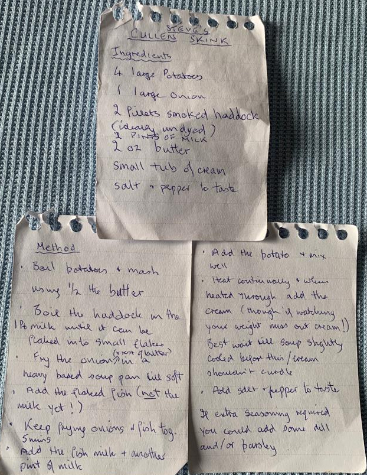
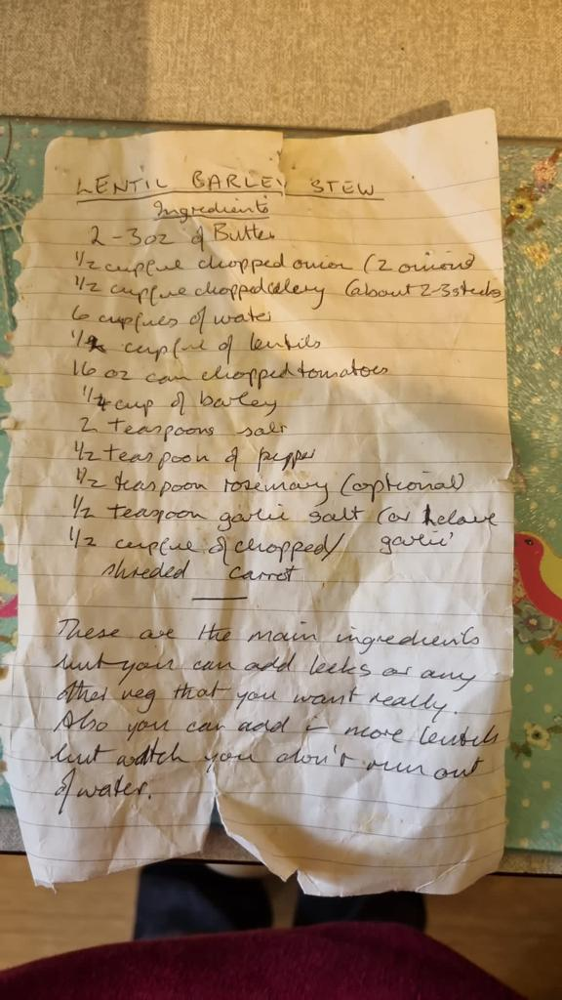
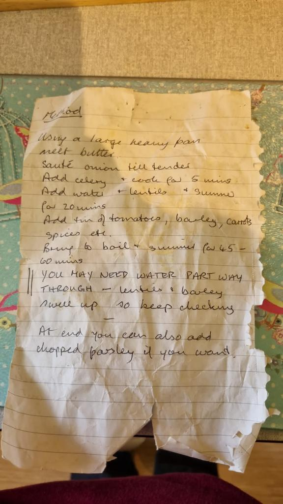
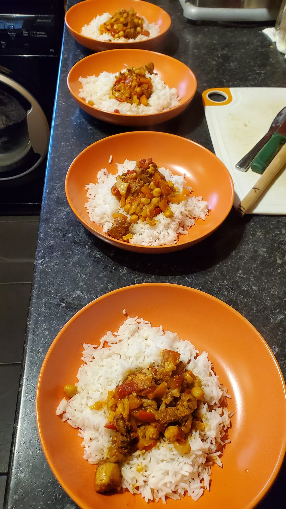
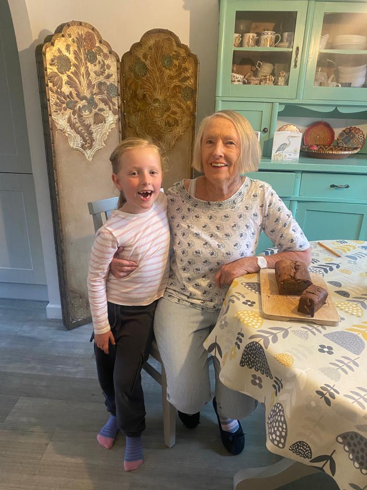
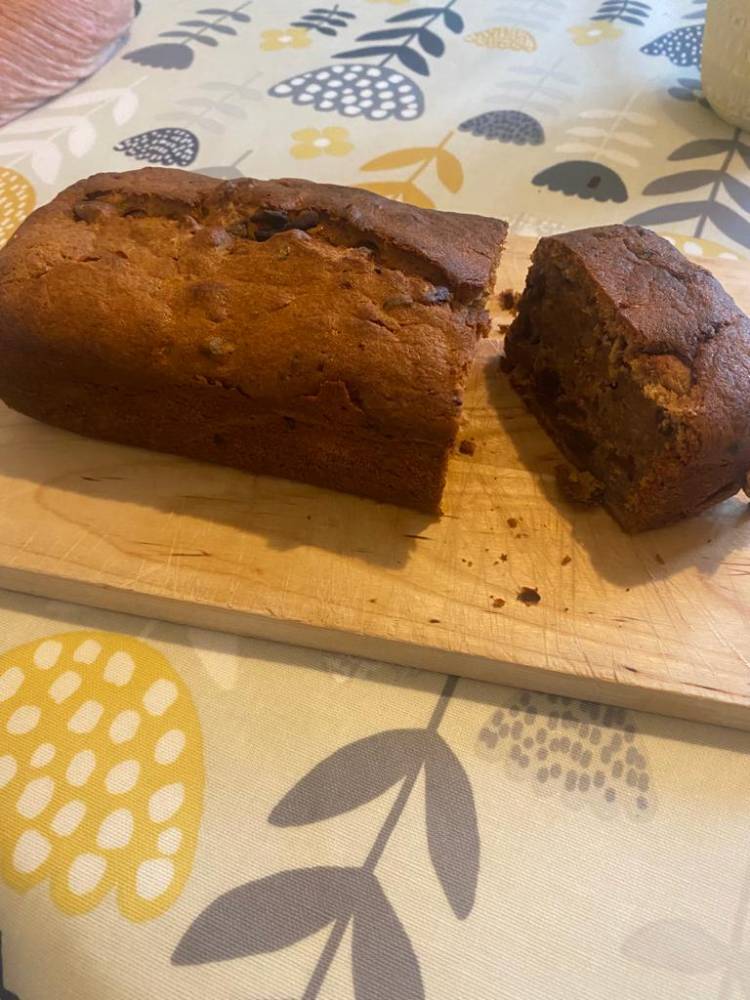
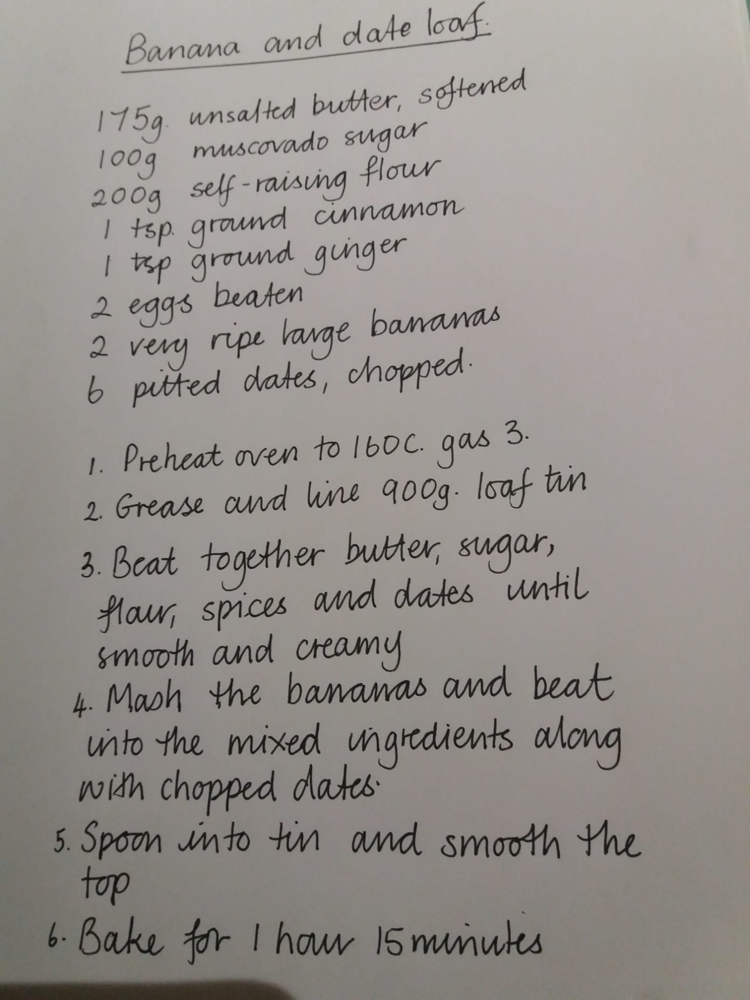

# From Steve and Jenni and family

```{r jenni,out.width="48%"}
knitr::include_graphics(c('./images/jenni_judy.jpg',
                          './images/Jenni_Steve.jpg',
                          './images/steve.jpg'))
```

## Food memories from Jenni
I may include my lasagne recipe which has a story attached.  I was very proudly making this for your gran and granddad the first time they visited us just after we got married.  I was so well prepared I had it made and in the freezer.  Forgot to bring it out on time so, at best, the lasagne was served lukewarm!  Yet being kindly parents-in-law, they said it was lovely! Not my best effort!! 

## Steve's cullen skink

```{r skink, fig.align='centre', out.width="90%"}

```

## Katy-Louise's barley stew
```{r lentils, fig.align='centre',out.width="85%",out.height="85%"}

```
\newpage
```{r lentils2, fig.align='centre',out.width="85%"}

```


# From Susan and Alvar

```{r alvars, fig.align='centre'}
knitr::include_graphics('./images/alvars.jpg')
```

```{r alvars2, fig.align='centre'}
knitr::include_graphics('./images/welsh_cake.pdf')
```

```{r alvars3, fig.align='centre'}

```


### Recipe for Alvars chicken curry
\
Super simple the following ingredients are all one teaspoon. 
\
Cumin. 
Paprika. 
Cinnamon.     
Cardamom. 
Cayenne pepper. 
Chilli flakes. 
Ground ginger. 
Tandoori masala. 
Garam masala. 
Jaggery powder. 
Tamarind   
Salt. 
2 teaspoons mild curry powder.    
1/2 teaspoons turmeric.    
Large finely chopped onion. 
3 cloves garlic.    
600g to 1kg chicken.   
About 2cm fresh ginger.  
Fresh or tinned tomatoes.  
And chopped vegetables of your choice.   
#### Method:-
\
Mix all spices and salt well and mix well with uncooked chicken, if possible leave 6 to 12 hours 
Fry onions well not allowing to burn after ten minutes add ginger and garlic. Fry for a further 5 minutes. 
Add chicken shortly followed by vegetables cook for a further 10 minutes with lid on, do not add water liquid will come from vegetables.
Finally added tomatoes and purre is recommended and leave to simmer gently for 20 minutes

\newpage

# From Ana
```{r ana_chorizo, out.width="45%"}
knitr::include_graphics(c('./images/chorizo.jpeg', 
                          './images/anastew.jpeg'))
```
```{r ana_chorizo2, out.width="45%"}
knitr::include_graphics(c('./images/judy_anasfriends.jpeg',
                          './images/jose.jpeg'))
```
\newpage

Hola! Aquí va mi receta,un día la compartí con Judy y creo que le gustó mucho.


#### Ingredientes:
\
-una calabaza mediana cruda. Se puede comprar en una pieza y pelar y trocear en casa, o comprarla ya cortada y envasada en Día o Mercadona
- Aceite de oliva virgen extra. AOVE.
- Ajo en polvo o varios dientes de ajo pelados.
- orégano.
- Jamón serrano en taquitos o lonchas 
- una pieza de chorizo fresco.

#### Elaboración:
\
Se pone en una sartén la calabaza previamente troceada en trocitos muy pequeños con dos cucharadas de aceite de oliva. Se salpimenta y se añade baste orégano y ajo en polvo.
Se añade un vaso de agua a la sartén para hacer que cueza la verdura y dejar a fuego lento unos quince minutos. Después comprobamos que la calabaza está tierna, añadimos trocitos muy pequeños de jamón y chorizo , que le darán mucho color y sabor. Servimos en un plato con biscotes o pan tierno alrededor , para untar con la mezclar o mojar...et Voilá!
Espero que os guste, un abrazo a todos desde Antequera, España.

\newpage

# From Rosie


```{r rosie, out.width="45%"}
knitr::include_graphics(c('./images/rosie.jpeg',
                          './images/nico_baby.jpg'))
```
```{r rosie2, out.width="45%"}
knitr::include_graphics(c('./images/nico.jpeg',
                          './images/rowan.jpeg'))
```
\newpage


#### Ingredients
\
Kid-Friendly Carrot Cake

1 1/3 cups oil. 

2 cups Granulated Sugar  

4 Eggs. 

2 1/2 cups All-Purpose Flour. 

2 teaspoons Baking Powder. 

2 teaspoons Baking Soda.  

2 teaspoons Cinnamon.  

1 teaspoon Salt.  

1 teaspoon Vanilla Extract.  

1/2 teaspoon Ground Mace.  

3 cups Grated Raw Carrots.  

1/2 cup Chopped Nuts. 

\newpage

# from Kay

```{r kay1, out.width="80%" }

```

```{r kay2, fig.align='centre', out.height="30%" }

```

```{r kay3,fig.align='centre', out.height="60%" }

```
