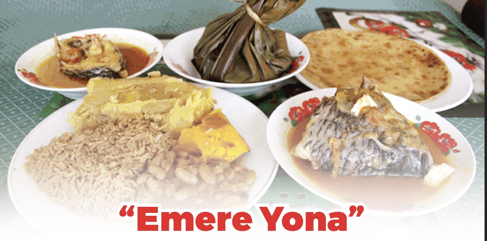

# From Nick and Family:
```{r nick_fam, fig.align='center', out.height="70%"}

```

## Emere Yona
```{r emere_yona, fig.align='center'}

```
"Emere Yona" is an expression in Uganda to suggest 'a bit of everything'.
It's not very common in tourist areas and only a few restaurants will offer this. However, it's very common in local or traditional restaurants.

The variety of staple foods include a mix of all or many of the following: Posho (nshima), rice, sweet potato, pumpkin, yam, chapati, cassava, matooke and so on.

These are eaten with sauces (relishes) including binyebwa, beans, greens, nyamas (meats) and fish.

The food (carbohydrates) would go with a sauce, beans, some pasted fish, Luwombo, chicken or meats of some sort.
2 mins ago
Peanut sauce is called binyebwa, which is raw groundnuts ground into a paste and cooked as a sauce to add to fish, chicken or meat. This makes the pink colouring to the meal. This is a very special quality to Ugandan foods. 

The greens include nakati, sukuma wiki, cabbage, entula, katunkuma (small), eggplant, green pepper and so on.

Matooke (Musa acuminata) is a green banana used as a staple in cooking.

Luwombo is a stew steamed in banana leaves; it has been considered to be a very special dish that was/is served only to very important guests in Ugandan culture.

Nakati - Ethiopian Eggplant (Solanum aethiopicum). The leaves are a very popular green and delicious. 
Sukuma wiki (collard greens) is an East African dish cooked with onions and spices.
Entula (Solanum macrocarpon) is an African baby egg plant
Bitter Berries (Katunkuma) are also used as a green

