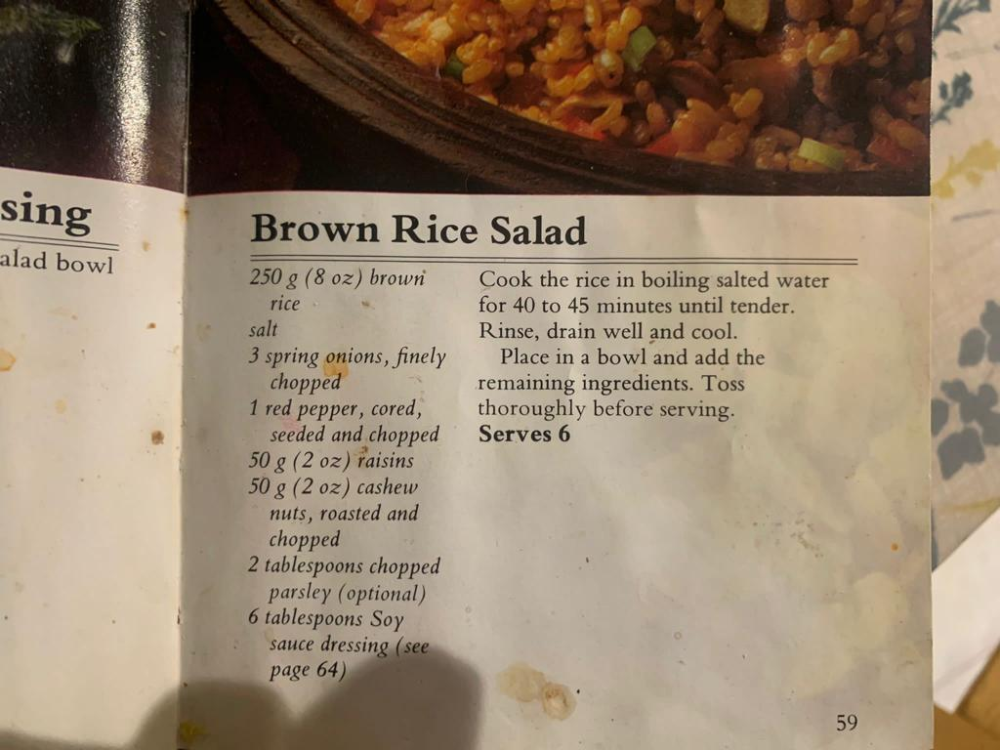
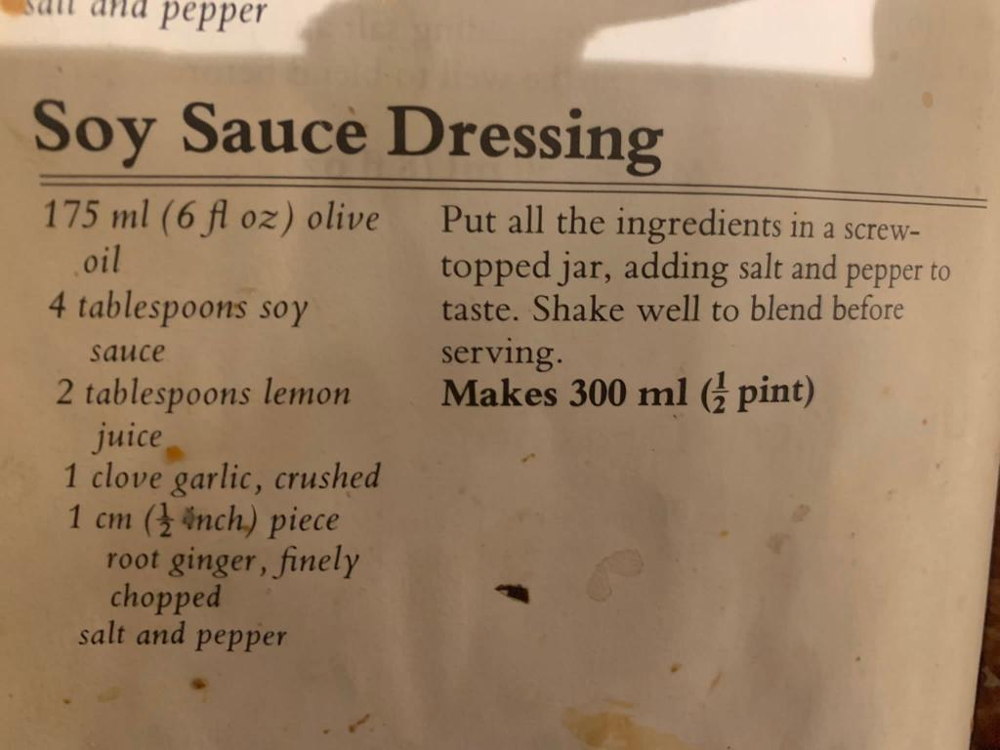

# From Clare and Family

```{r hoptons, out.width="48%"}
knitr::include_graphics(c('./images/claire_fam.jpeg','./images/martha_simming_goggles.jpeg','images/isa_alice.jpeg','images/clare_n_julia.jpeg'))
```

## Brown rice and Soy Sauce Dressing

```{r sauce}

```
```{r sauce2}

```

## Memories from Alice

### Fond memories: 

#### Mac and cheese

Pilar, Robert, Isabel, Martha and I used to love mac and cheese day in Bedlinog during our Summer holiday visits. Judy would always use shell pasta as we would call it, or conchiglie as they call it in Italy. It was the simplest, most delicious pasta that I had ever tasted and not once have I or my family successfully replicated it. I have a distinct memory of picking up a recipe from grandma Judy, reading it out to mum and her saying "there's no way we are using a whole block of cheese" and realising, that's why it would never taste as good. The delicious, peppery, creamy and cheesy meal would fill you up for what you felt like might be an entire week. 

#### Fruit salad afternoons

Every afternoon on our Summer visits to Bedlinog the cousins would sit and watch cbeebies, CBBC, nickolodeon or whatever we could find on the Children's section of sky tv, and eat grabdma Judy's great big shared plates of lovingly chopped up fruits: peach, nectarine, oranges, apples, bananas, pears or whatever was available from the local stores in Bedlinog at the time, which was amazing because each great big pile of fruit always looked so tropical and inviting. 

There's something so delicious about a shared plate, that increases the taste levels of your favourite when you're anxious someone else is going to grab the last piece!!

#### 7 course meal

I distinctly remember the fanciest meal I have ever eaten - at the culinary school in Antequera with Judy. Now, I don't remember all the courses but I do remember the intensity of the rich flavours and how full and ready for a siesta I felt afterwards, after the endless courses kept coming and coming. There was an amazing seabass course with 2 different sauces: a white and a red wine sauce that was like nothing I've tasted before. 

#### Fartons in Ronda and Churros in Antequera

We all know Abuela Judy for her delicious savoury meals, but we also sometimes enjoyed a sugary sweet treat together the tasty fartón for example - sugary sweet pastries in the beautiful town of Ronda, that I'd stared at on a painting of the famous Puente Nuevo bridge in the Bedlinog house. One visit to Antequera when I was around 9 or 10 I distinctly remember wanting to have churros con chocolate EVERY time I visited a cafe with Judy or my parents. I presumed it was a daily activity, a standard breakfast for the Spanish, and I relished the opportunity to compare the different textures, lengths and sizes of churros. I was fascinated by the new food and blissfully unaware of the concept of calories or fat content. Watching the lady freshly a few streets down from abuela's house ladel batter into a huge vat of oil outside her own home was nothing but exciting and appetising. I think everyone was so suprised at the amount I could eat for someone so small!

Whether it was apricot jam, croquetas at a bar and a catch up or chicken for two from the pollo place in Antequera, treat visits to the newsagents in Bedlinog for paper bags 
of pick and mix with Pilar, Robert, Isa and Martha, magdalenas in the morning, making pizza from scratch with cousins, angel delight, tapas or stew, food shared with abuela brings to life many beautiful moments and childhood memories shared. I know abuela Judy passed down her passion to food for more than just one of her grandchildren, and I am ever grateful for that.

